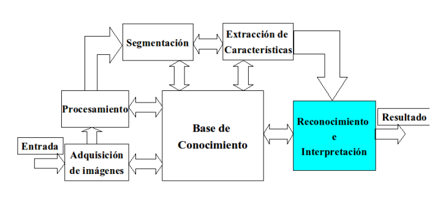

 
# 
 Reconocimiento básico de gestos de la lengua de Señas Colombiana
#### 
 Universidad Nacional de Colombia
#### 
 Proyecto Técnicas de Inteligencia Artificial
>**Jose Ricardo Rincón Peláez**

>Felipe Rojas 

>Jefferson Domínguez

>Johan Rincón

---

### Resumen 
Aproximadamente el 7% de la población colombiana presenta discapacidades auditivas que afectan su calidad de vida, principalmente por la barrera que limita su comunicación por la falta de educación de la población general al no tener necesidad de aprender lengua de señas y dado que esta lengua generalmente es autóctona a cada país [Mapenzi]. Existen diferentes herramientas que buscan brindar un apoyo a esta población, sin embargo, es necesario implementar nuevas estrategias tecnológicas que permitan que la población general integre de manera eficaz a esta población marginada. 

Por lo anterior, el objetivo general de este proyecto es aplicar diversas estrategias de inteligencia artificial en un modelo que mediante el análisis de imágenes sea capaz de detectar diversos gestos pertenecientes a la lengua de señas colombiana con la finalidad de ser traducidos a otro lenguaje. Esto permitirá romper de cierto modo la brecha existente y servirá como un apoyo a esta población.

Para el desarrollo del proyecto, se propone una metodología que estará ligada con el avance del curso Técnicas de Inteligencia Artificial de la Universidad Nacional de Colombia, el cual aportará las herramientas necesarias para la implementación de una solución que permita cumplir los objetivos establecidos y el alcance del proyecto. En el siguiente documento se establecen los lineamientos, metodologías y bases necesarias para su adecuado desarrollo. 
### Justificación
- INSOR: La población sorda en el país es de 314.320 personas.
- El 50 % son adultos mayores.
- En Bogotá, solo el 50% de los niños entre 5-16 años de esta población están matriculados en un colegio.
- La lengua de señas es diferente para cada país.

### Objetivo
El proyecto comunicación inclusiva tiene como objetivo desarrollar un algoritmo capaz de reconocer gestos básicos realizados con las manos, pertenecientes a la lengua de señas. Estos gestos serán limitados al abecedario colombiano, LSC.
### Metodología
El siguiente diagrama muestra los pasos necesarios para la clasificación de imagenes. 

  
El trabajo completo se encuentra en el archivo PruebaTotalPropia.ipynb . Adicionalmente el archivo TakePicture.ipynb permite capturar las fotos y guardarlas en la carpeta NewPictures
